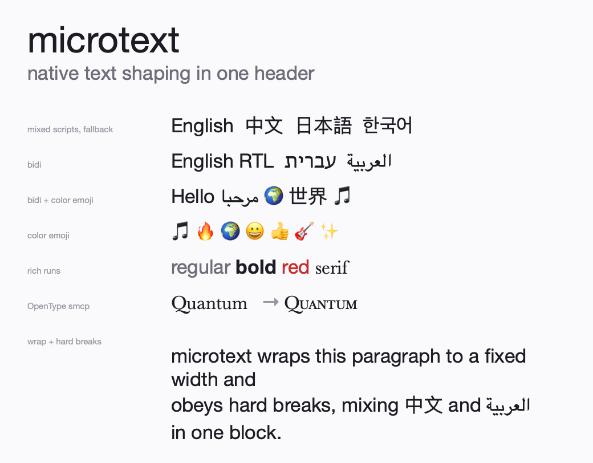
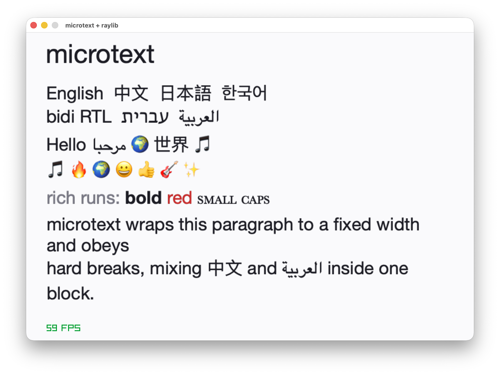

# microtext


A single-header C(C99) library for modern text:
Bidi, complex shaping, CJK, color emoji, and font fallback.
macOS only for now (CoreText);


## Quick start

Copy `microtext.h` into your working path and `#define MICROTEXT_IMPLEMENTATION` then you can go.

```c
#define MICROTEXT_IMPLEMENTATION
#include "microtext.h"
...

    mt_font *f = mt_font_open("Helvetica Neue", 40.0f);   // NULL family = system UI font
    int w, h;
    mt_metrics m;
    unsigned char *rgba = mt_render(f, "Hello 你好 \U0001F3B5", -1,
                                    (mt_color){20, 20, 20, 255}, &w, &h, &m);
    // rgba is w*h 8-bit sRGB RGBA, straight alpha, top row first. Upload it, then:
    mt_free(rgba);
    mt_font_close(f);
...
```

Compile with the right backend deps (MacOS, that is coretext)

```sh
clang -std=c99 yourfile.c -o yourapp \
    -framework CoreText -framework CoreGraphics -framework CoreFoundation
```

Integrate is simple, `examples/demo_2_raylib.c` show how to integrate into raylib 


## Development

See [develop.md](doc/develop.md).

## API & Internals

See [doc.md](doc/doc.md).

## License

MIT
